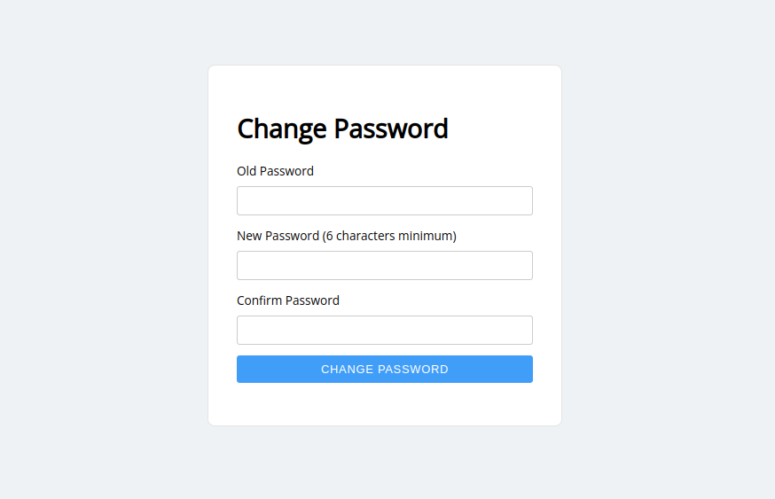

Change Password
===============

change_password
---------------

An endpoint where the authenticated user can change their password. If you send
a GET request to  this endpoint, a simple form is shown in which the user can
change their password manually.

.. hint::
    You can use a custom template, which matches the look and feel of your
    application. See the ``template_path`` parameter. Or specify custom CSS
    styles using the ``styles`` parameter.

Alternatively, you can change the password programatically by sending a POST
request to this endpoint (passing in ``old_password``, ``new_password`` and
``confirm_new_password`` parameters as JSON, or as form data).

When the password change is successful, we invalidate the session cookie, and
redirect the user to the login endpoint.

.. warning::
    Only authenticated users can change their passwords!

Example
~~~~~~~

In this example we show how the endpoint integrates with a Starlette app using
session auth.

For the complete source code, see `the demo project on GitHub <https://github.com/piccolo-orm/piccolo_api/tree/master/example_projects/change_password_demo>`_.

.. literalinclude:: ../../../example_projects/change_password_demo/app.py

If you want to use FastAPI instead, just make the following minor changes:

* Change the imports from ``starlette`` -> ``fastapi``
* Change ``Starlette`` -> ``FastAPI``

Source
~~~~~~

.. currentmodule:: piccolo_api.change_password.endpoints

.. autofunction:: change_password
