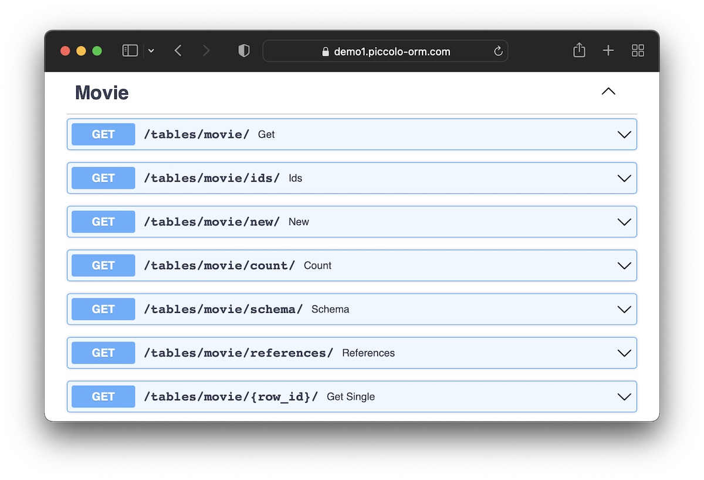

FastAPI
=======

`FastAPI <https://fastapi.tiangolo.com/>`_ is a powerful ASGI web framework,
built on top of `Starlette <https://www.starlette.io/>`_, which lets you build
an API very easily, with interactive docs.

It does this by making heavy use of type annotations.

By using ``FastAPIWrapper`` we can annotate our ``PiccoloCRUD`` endpoints so
FastAPI can automatically document them for us. It's an incredibly productive
way of building an API.

We're able to create all of these endpoints, and more, with very little code:

-------------------------------------------------------------------------------

Example
-------

In this example we're building the API for a movie app. Assuming you have
defined a Piccolo ``Table`` called ``Movie``:

.. code-block:: python

    # app.py

    from fastapi import FastAPI
    from piccolo_api.fastapi.endpoints import FastAPIWrapper
    from piccolo_api.crud.endpoints import PiccoloCRUD

    from movies.tables import Movie

    app = FastAPI()

    FastAPIWrapper(
        root_url="/movie/",
        fastapi_app=app,
        piccolo_crud=PiccoloCRUD(
            table=Movie,
            read_only=False,
        )
    )

We can now run this app using an ASGI server such as uvicorn.

.. code-block:: bash

    uvicorn app:app

Then try out the following:

* OpenAPI docs: http://127.0.0.1:8000/docs/
* API endpoint: http://127.0.0.1:8000/movie/

To see full examples of FastAPI apps built this way, take a look at:

* `PyMDb - a movie database <https://github.com/piccolo-orm/pymdb>`_.
* `A headless blog <https://github.com/piccolo-orm/piccolo_examples/tree/master/headless_blog_fastapi>`_.

-------------------------------------------------------------------------------

Configuring the endpoints
-------------------------

If you want more control over the endpoints, you can do so using :class:`FastAPIKwargs <piccolo_api.fastapi.endpoints.FastAPIKwargs>`,
which allows you to specify additional arguments to pass into ``FastAPIApp.add_api_route``.

Example
~~~~~~~

In the following example, we add `tags <https://fastapi.tiangolo.com/tutorial/path-operation-configuration/#tags>`_
to the endpoints, which separates them in the docs UI.

We also mark one of the endpoints as deprecated.

.. code-block:: python

    from fastapi import FastAPI
    from piccolo_api.fastapi.endpoints import FastAPIWrapper, FastAPIKwargs
    from piccolo_api.crud.endpoints import PiccoloCRUD

    from my_app.tables import Task

    app = FastAPI()

    FastAPIWrapper(
        root_url="/task/",
        fastapi_app=app,
        piccolo_crud=PiccoloCRUD(
            table=Task,
            read_only=False,
        ),
        fastapi_kwargs=FastAPIKwargs(
            all_routes={'tags': ['Task']},  # Added to all endpoints
            get={'deprecated': True},  # Just added to the 'get' endpoint
        )
    )

-------------------------------------------------------------------------------

Authentication
--------------

You can wrap your FastAPI app with any of our authentication middleware, such as
:ref:`SessionAuthMiddleware <SessionAuthMiddleware>`.

If you want to use FastAPI's builtin `OAuth2 <https://fastapi.tiangolo.com/tutorial/security/>`_
features to protect some endpoints, you can do so as follows:

OAuth2 example
~~~~~~~~~~~~~~

In the following example we pass dependencies into ``FastAPIKwargs`` to protect
endpoints with unsafe HTTP methods.

.. code-block:: python

    from fastapi import Depends, FastAPI
    from fastapi.security import OAuth2PasswordBearer
    from piccolo_api.fastapi.endpoints import FastAPIWrapper, FastAPIKwargs
    from piccolo_api.crud.endpoints import PiccoloCRUD

    from my_app.tables import Task

    app = FastAPI()

    oauth2_scheme = OAuth2PasswordBearer(tokenUrl="login")

    FastAPIWrapper(
        root_url="/task/",
        fastapi_app=app,
        piccolo_crud=PiccoloCRUD(
            table=Task,
            read_only=False,
        ),
        fastapi_kwargs=FastAPIKwargs(
            all_routes={'tags': ['Task']},  # Added to all endpoints
            post={"dependencies": [Depends(oauth2_scheme)]}, # protected route
            put={"dependencies": [Depends(oauth2_scheme)]},  # protected route
            patch={"dependencies": [Depends(oauth2_scheme)]},  # protected route
            delete_single={"dependencies": [Depends(oauth2_scheme)]},  # protected route
        )
    )

See this `example project <https://github.com/sinisaos/headless-forum-fastapi>`_
for more details.

-------------------------------------------------------------------------------

Source
------

.. currentmodule:: piccolo_api.fastapi.endpoints

FastAPIWrapper
~~~~~~~~~~~~~~

.. autoclass:: FastAPIWrapper

FastAPIKwargs
~~~~~~~~~~~~~

.. autoclass:: FastAPIKwargs
