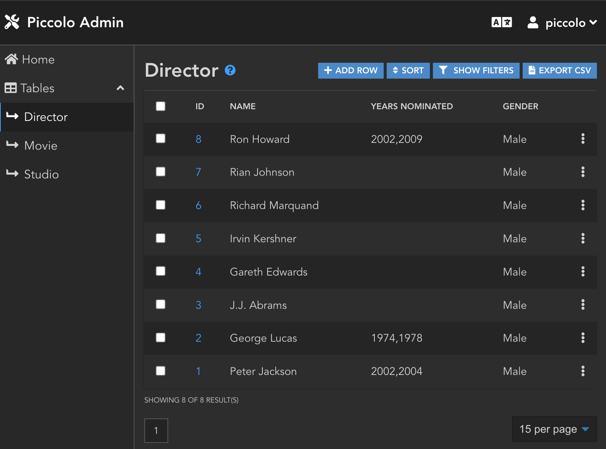

Piccolo Admin
=============

`Piccolo Admin <https://piccolo-admin.readthedocs.io/en/latest/>`_ is a
powerful web GUI which can be used to manage your data.

It's similar to tools like Django Admin and WordPress, but uses a rich Vue.js
front end, with a modern REST backend.

Piccolo API powers Piccolo Admin. If you want to see how the technologies
outlined here all work together, it's recommended to look at the Piccolo Admin
source code.

