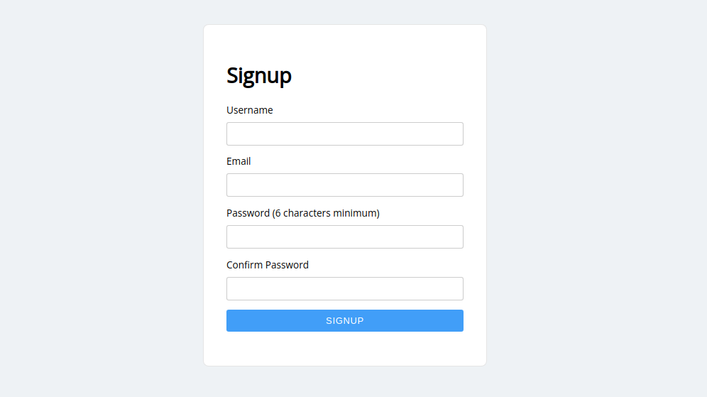

Endpoints
=========

register
--------

An endpoint for registering a user. If you send a GET request to this endpoint,
a simple registration form is rendered, where a user can manually sign up.

.. hint::
    You can use a custom template, which matches the look and feel of your
    application. See the ``template_path`` parameter.

Alternatively, you can register a user programatically by sending a POST
request to this endpoint (passing in ``username``, ``email``, ``password`` and
``confirm_password`` parameters as JSON, or as form data).

When registration is successful, the user can be redirected to a login endpoint.
The destination can be configured using the ``redirect_to`` parameter.

Examples
~~~~~~~~

Here's a Starlette example:

.. code-block:: python

    from piccolo_api.register.endpoints import register
    from starlette import Starlette

    app = Starlette()

    app.mount('/register/', register(redirect_to="/login/"))

Here's a FastAPI example:

.. code-block:: python

    from fastapi import FastAPI
    from piccolo_api.register.endpoints import register

    app = FastAPI()

    app.mount('/register/', register(redirect_to="/login/"))

Security
~~~~~~~~

The endpoint is fairly simple, and works well for building a quick prototype,
or internal application. If it's being used on the public internet, then extra
precautions are required.

Rate limiting
*************

One option is to apply rate limiting to this endpoint. This can be done using
:class:`RateLimitingMiddleware <piccolo_api.rate_limiting.middleware.RateLimitingMiddleware>`.
Modifying the FastAPI example above:

.. code-block:: python

    from fastapi import FastAPI
    from piccolo_api.rate_limiting.middleware import (
        RateLimitingMiddleware, InMemoryLimitProvider
    )
    from piccolo_api.register.endpoints import register

    app = FastAPI()

    app.mount(
        '/register/',
        RateLimitingMiddleware(
            register(redirect_to="/login/"),
            InMemoryLimitProvider(
                timespan=3600,  # 1 hour
                limit=20,
                block_duration=86400  # 24 hours
            )
        )
    )

We have used quite aggressive rate limiting here - there is no reason for
a user to visit a registration page a large number of times.

.. _RegisterCAPTCHA:

CAPTCHA
*******

Alternatively, we can easily integrate a `CAPTCHA <https://en.wikipedia.org/wiki/ReCAPTCHA>`_ service.
Sign up for an account with `hCaptcha <https://www.hcaptcha.com/>`_ or
`reCAPTCHA <https://www.google.com/recaptcha/about/>`_, and then do the
following:

.. code-block:: python

    from fastapi import FastAPI
    from piccolo_api.register.endpoints import register
    from piccolo_api.shared.auth.captcha import hcaptcha, recaptcha_v2

    app = FastAPI()

    # To use hCaptcha:
    app.mount(
        '/register/',
        register(
            redirect_to="/login/",
            captcha=hcaptcha(
                site_key='my-site-key',
                secret_key='my-secret-key',
            )
        )
    )

    # To use reCAPTCHA:
    app.mount(
        '/register/',
        register(
            redirect_to="/login/",
            captcha=recaptcha_v2(
                site_key='my-site-key',
                secret_key='my-secret-key',
            )
        )
    )

For a complete example app, see `here <https://github.com/piccolo-orm/piccolo_api/tree/master/example_projects/register_demo/>`_.

Building your own
~~~~~~~~~~~~~~~~~

There is no one-size-fits-all registration solution. You can use this endpoint
as a basis for your own solution, which fits the needs of your
application. For example, you can add extra registration fields.

Source
~~~~~~

.. currentmodule:: piccolo_api.register.endpoints

.. autofunction:: register
