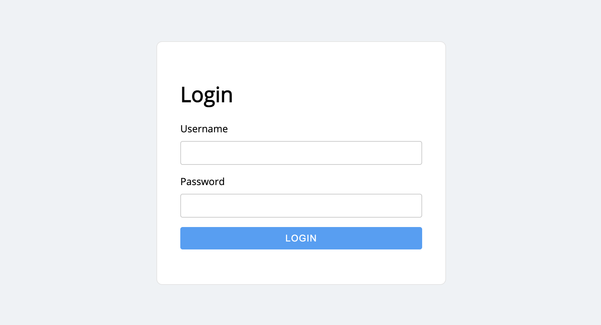
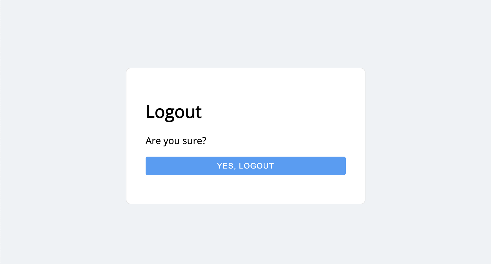

Endpoints
=========

Endpoints are provided for session login and logout. They are designed to
integrate with an ASGI app, such as Starlette or FastAPI.

-------------------------------------------------------------------------------

session_login
-------------

An endpoint for creating a user session. If you send a GET request to this
endpoint, a simple login form is rendered, where a user can manually login.

.. hint::
    You can use a custom login template, which matches the look and feel of
    your application. See the ``template_path`` parameter.

Alternatively, you can login programatically by sending a POST request to
this endpoint (passing in ``username`` and ``password`` parameters as JSON, or
as form data).

When login is successful, the user is redirected. The destination can be
configured using the ``redirect_to`` parameter.

Additional security
~~~~~~~~~~~~~~~~~~~

It's recommended to protect any login endpoints with :ref:`rate limiting middleware <RateLimiting>`,
to help slow down any brute force attacks.

Examples
~~~~~~~~

Here's a Starlette example:

.. code-block:: python

    from piccolo_api.session_auth.endpoints import session_login
    from starlette import Starlette

    app = Starlette()

    app.mount('/login/', session_login())

Here's a FastAPI example:

.. code-block:: python

    from piccolo_api.session_auth.endpoints import session_login
    from fastapi import FastAPI

    app = FastAPI()

    app.mount('/login/', session_login())

Source
~~~~~~

.. currentmodule:: piccolo_api.session_auth.endpoints

.. autofunction:: session_login

-------------------------------------------------------------------------------

session_logout
--------------

This unsets the cookie value, and invalidates the session in the database, if
you send a POST request.

If you send a GET request, a simple logout form is rendered, where a user can
manually logout.

.. hint::
    You can use a custom logout template, which matches the look and feel of
    your application. See the ``template_path`` parameter.

Examples
~~~~~~~~

Here's a Starlette example:

.. code-block:: python

    from piccolo_api.session_auth.endpoints import session_logout
    from starlette import Starlette

    app = Starlette()

    app.mount('/logout/', session_logout())

Here's a FastAPI example:

.. code-block:: python

    from piccolo_api.session_auth.endpoints import session_logout
    from fastapi import FastAPI

    app = FastAPI()

    app.mount('/login/', session_logout())

Source
~~~~~~

.. currentmodule:: piccolo_api.session_auth.endpoints

.. autofunction:: session_logout
