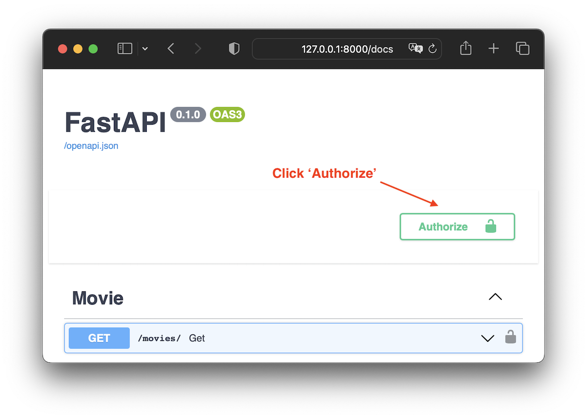
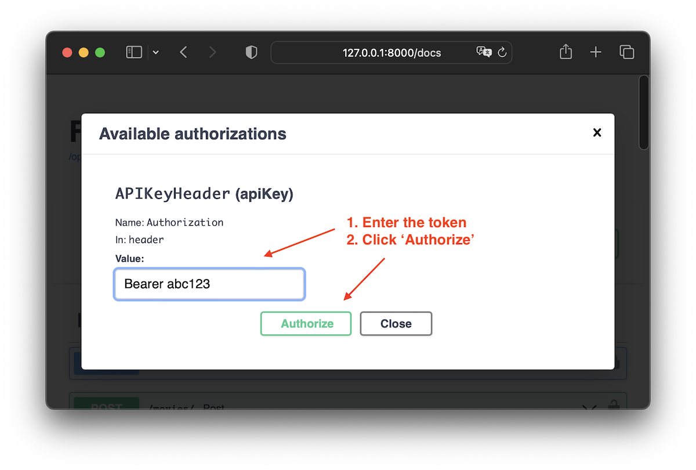

Middleware
==========

.. currentmodule:: piccolo_api.token_auth.middleware

The middleware builds upon Starlette's ``AuthenticationMiddleware`` (see the
`docs <https://www.starlette.io/authentication/>`_).

:class:`TokenAuthBackend` is used to extract the token from the request. If the token
is present and correct, then the request is accepted and the corresponding user
is added to the scope, otherwise it is rejected.

``TokenAuthBackend`` can work with several different :class:`TokenAuthProvider`
subclasses. The following are provided by default, but custom ones can be
written by creating your own ``TokenAuthProvider`` subclasses.

``SecretTokenAuthProvider``
---------------------------

This provider checks whether the token provided by the client matches a list of
predefined tokens.

.. code-block:: python

    from starlette.middleware.authentication import AuthenticationMiddleware

    from piccolo_api.token_auth.middleware import (
        TokenAuthBackend,
        SecretTokenAuthProvider,
    )

    app = AuthenticationMiddleware(
        my_asgi_app,
        backend=TokenAuthBackend(SecretTokenAuthProvider(tokens=["abc123"])),
    )

If successful a user called ``secret_token_user`` is added to the scope.

This provider is useful for protecting internal services, where the client is
trusted not to leak the tokens.

It is also useful for protecting login endpoints when accessed from native
apps. The client provides the token to be able to access the login endpoint,
after which they obtain a unique token, which is used to authenticate with
other endpoints.

``PiccoloTokenAuthProvider``
----------------------------

This provider checks a Piccolo database table for a corresponding token, and
retrieves a matching user ID. It is the default provider.

.. code-block:: python

    from starlette.middleware.authentication import AuthenticationMiddleware

    from piccolo_api.token_auth.middleware import (
        TokenAuthBackend,
        PiccoloTokenAuthProvider,
    )

    app = AuthenticationMiddleware(
        my_asgi_app,
        backend=TokenAuthBackend(PiccoloTokenAuthProvider()),
    )

You'll have to run the migrations for this to work correctly.

-------------------------------------------------------------------------------

``TokenAuthBackend``
--------------------

``excluded_paths``
~~~~~~~~~~~~~~~~~~

By default, the middleware protects all of the endpoints it is wrapping (i.e.
if a token isn't present in the header then the request is rejected).

However, we may want to exclude certain endpoints - for example, if there's a
Swagger docs endpoint, and allow access to them without a token. This is
possible using ``excluded_paths``.

Paths can be specified explicitly, or using wildcards:

.. code-block:: python

    TokenAuthBackend(
        PiccoloTokenAuthProvider(),
        excluded_paths=["/docs", "/openapi.json", "/foo/*"],
    )

.. note:: In the above example ``/foo/*`` matches ``/foo/``,  ``/foo/a``, ``/foo/b``, ``/foo/b/1`` etc.

This is useful when using Swagger docs as they can be viewed in a browser,
but they are still token protected.

FastAPI example
***************

If we want to communicate with the API endpoints via the Swagger docs, we need to set `FastAPI APIKeyHeader <https://github.com/tiangolo/fastapi/blob/c81e136d75f5ac4252df740b35551cf2afb4c7f1/fastapi/security/api_key.py#L41>`_
as a dependency. After that we can authorise the user with a valid token as in
the example below.

.. literalinclude:: ./examples/excluded_paths_example/app.py

The user can then use the Swagger docs to interact with the API.

.. note::
    The full source code is available on GitHub. Find the source for this
    documentation page, and look at the ``examples`` folder.

-------------------------------------------------------------------------------

Source
------

.. autoclass:: TokenAuthBackend

.. autoclass:: TokenAuthProvider

.. autoclass:: PiccoloTokenAuthProvider

.. autoclass:: SecretTokenAuthProvider
